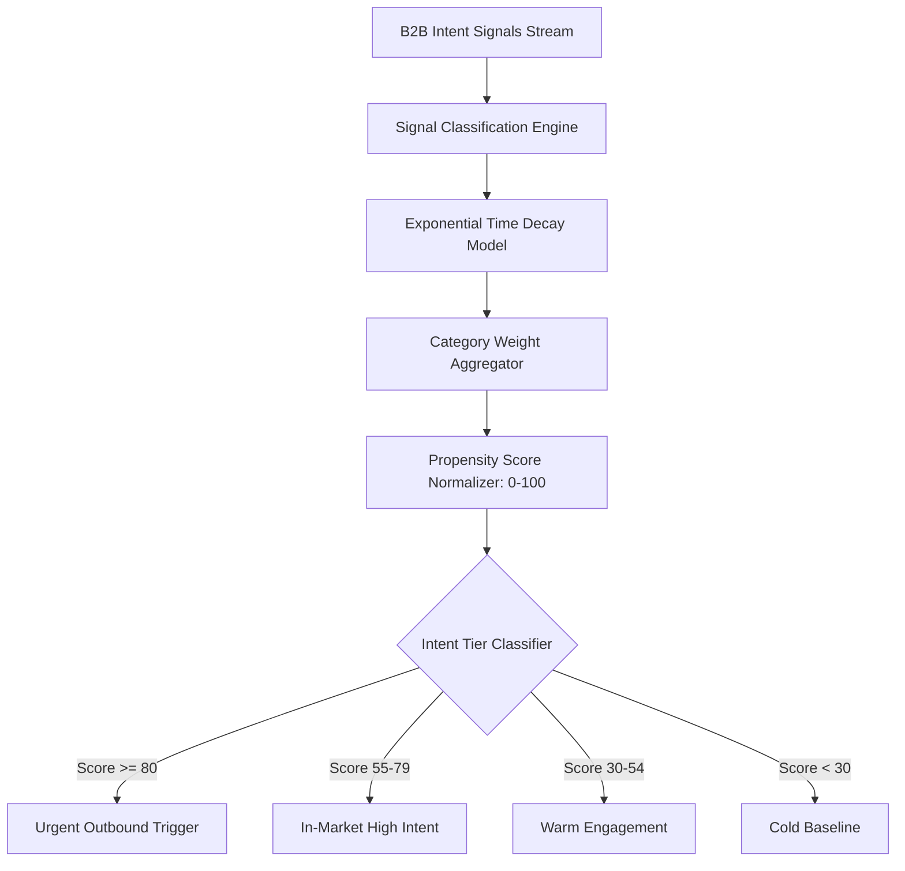

# GenPark AI Agent Skill - Intent Signal Propensity Scorer

Calculates predictive B2B outbound buying propensity scores by aggregating time-decayed hiring signals, venture funding injections, and technographic stack shifts.

Verified by [GenPark AI](https://genpark.ai) and compatible with [Model Context Protocol (MCP)](https://genpark.ai/mcp).

## Architecture Diagram

## Features
- **Exponential Half-Life Decay**: Naturally depreciates outdated signals while prioritizing high-velocity recent catalysts.
- **Deterministic Categorization**: Assigns precise outbound actions based on quantitative score boundaries.
- **Zero Third-Party Dependencies**: Pure Python standard library implementation.
- **Ready for MCP Agent Swarms**: Enables autonomous GTM agents to prioritize target accounts.
